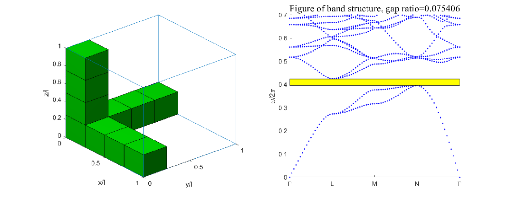
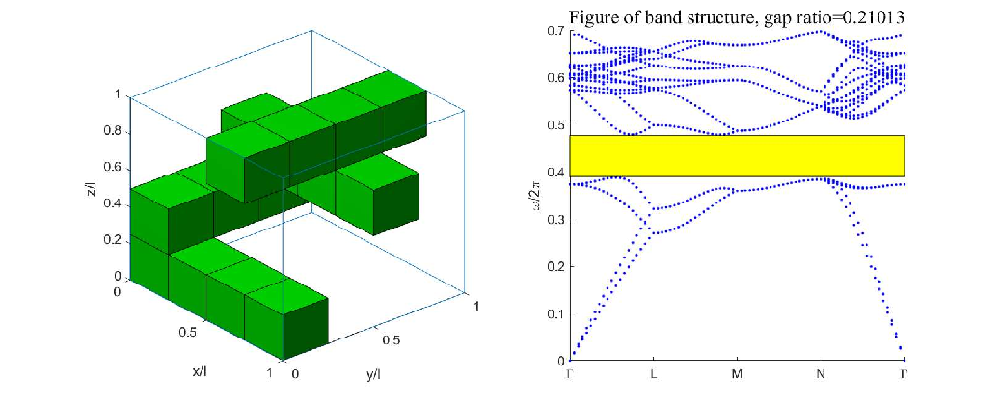
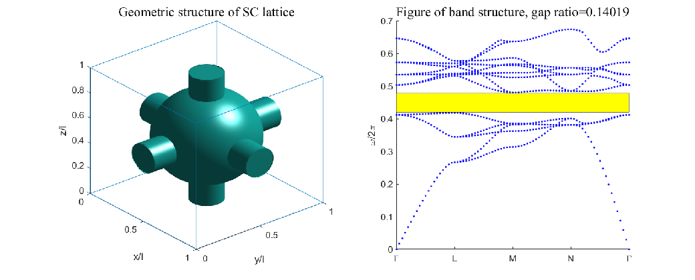
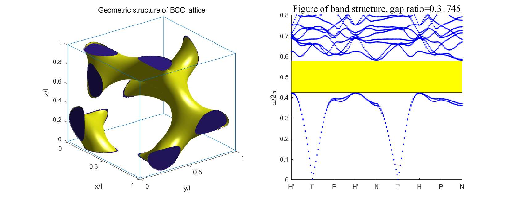
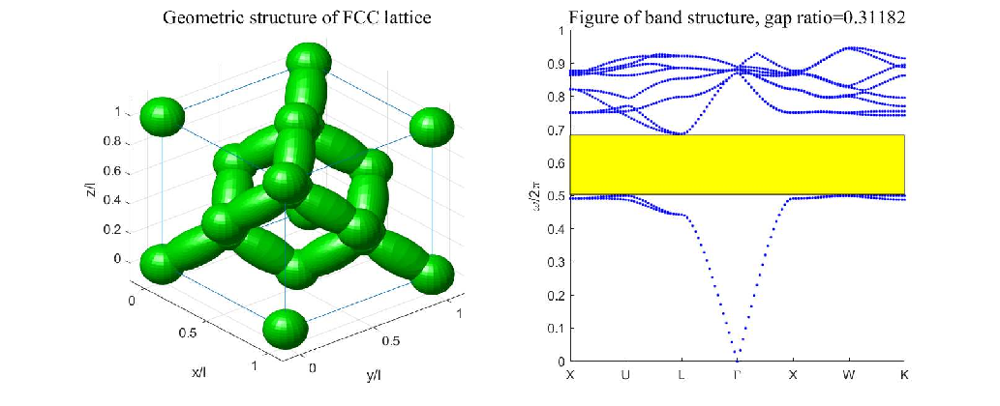

# linear-eigenvalue-problems-in-photonic-crystals
 

## Introduction
**Advanced computational framework for photonic bandgap analysis**  
This repository implements a novel kernel compensation method and double curl operator eigendecomposition for accurate photonic crystal characterization. The package provides cross-platform solutions in both MATLAB and Python for:

- Frequency spectrum computation
- Bandgap detection
- Maxwell eigenproblem solving

### Key Features
✅ **LOBPCG Eigensolver**  
Implements Locally Optimal Block Preconditioned Conjugate Gradient (LOBPCG) method with adaptive preconditioning for accelerated convergence

✅ **Multi-physics Modules**  
- Dielectric tensor manipulation toolkit  
- Mimetic finite difference discretization  
- Curl-conforming eigenvalue solver  
- Band structure visualization

### Theoretical Foundation
The core methodology is detailed in our peer-reviewed publication:  
**"Kernel Compensation Method for Maxwell Eigenproblem in Photonic Crystals With Mimetic Finite Difference"**  
_Numer. Methods Partial Differential Eq._ 2024.  

## Mathematical procedure of setup
### Model problem
$$
\begin{cases}
\nabla\times(\varepsilon^{-1}\nabla\times \vec H)=\omega^2\vec H,\\
\nabla\cdot\vec H=0.
\end{cases}
$$

Dielectric coefficient $\varepsilon$ is a positive periodic piecewise constant such that $\varepsilon\in[\varepsilon_0,\varepsilon_1]$. $\omega$ is the frequency. $\vec H$ is the magnetic field satisfying the boundary condition: $\vec H(\vec x+\vec a_n)=e^{\sqrt{-1}\vec\alpha\cdot\vec x}\vec H(\vec x),$ where $\vec\alpha$ belongs to the first Brillouin zone and $\vec a_n\ (n = 1,2,3)$ are translation vectors that span the primitive cell. 

Common lattice type:

$$
\begin{cases}
\text{SC lattice:\ }\vec a_1=(l,0,0)^T, \ \ \vec a_2=(0,l,0)^T,\ \ \vec a_3=(0,0,l)^T.\\
\text{FCC lattice:\ }\vec a_1=(0,\frac{l}{2},\frac{l}{2})^T, \ \vec a_2=(\frac{l}{2},0,\frac{l}{2})^T,\ \vec a_3=(\frac{l}{2},\frac{l}{2},0)^T.\\
\text{BCC lattice:\ }\vec a_1=(-\frac{l}{2},\frac{l}{2},\frac{l}{2})^T,\ \vec a_2=(\frac{l}{2},-\frac{l}{2},\frac{l}{2})^T,\ \vec a_3=(\frac{l}{2},\frac{l}{2},-\frac{l}{2})^T.
\end{cases}
$$

Through a simple coordinate change FCC, BCC lattice can also be transformed into periodicity along normal coordinate $(1,0,0)^T,\ (0,1,0)^T,\ (0,0,1)^T$.

### Matrix blocks
Details are referred to the paper. Here we birefly explain how matrix blocks are setup in the program. The grid size is set to be $N$ (uniformly divided into N segments along three dimensions). The discrete format of original model problem is written by:

$$
(\mathcal{A}M_0\mathcal{A}'+\gamma\mathcal{B}'\mathcal{B})\vec x = \omega^2\vec x.
$$

Matrix $\mathcal{A}$ and $\mathcal{B}$ are discrete matrix of operator curl and divergence. $M_0$ is a diagonal matrix arising from $\varepsilon^{-1}$. $\gamma > 0$ refers to the penalty coefficient that gaurentees the correctness of the algorithm. The following steps explain how $\mathcal{A}$ and $\mathcal{B}$ are formulated.

**(1) MFD stencil:** generate 1D finite difference stencil, two arrays of length $2k$, $k$ refers to the order of stencil.

**(2) Diag complex:** circulant matrix can be diagonalized by FFT matrix. This step computes two arrays of length N. 

**(3) Kronecker product with identity:** assume $D_1$ to be the discrete matrix that approximated 1st order derivative in 1D space, then differential $dx, dy, dz$ can be approximated by 

$$
I_{N^2}\otimes D_1,\quad I_N\otimes D_1\otimes I_N,\quad D_1\otimes I_{N^2}
$$

respectively, each of length $N^3$. In this step we generate 6 arrays of length $N^3$ through a triple loop, representing $dx,dy,dz$ and actions of  $\vec\alpha$ along three dimensions. Coordinate change is also added. In both Matlab and Python scripts there exists a "set_blocks" function which realize the subprocess. 

**(4) Function handles:** $\mathcal{A},\ \mathcal{B}$ and preconditioning. Three function handles follow similar routines: forward 3D FFT, block diagonal element-wise operation and backward 3D FFT. The element-wise operations can be efficiently accelerated by CUDA or OpenMP.

We emphasize that subprocess (3) is essential because when we compute the band, which involves multiple $\vec\alpha$'s, (3) is applied only once and function handles are updated based on matrix blocks in (3) so that we can avoid repetitive operations.

### Dielectric coefficients
In practice, $\varepsilon$ equals to either 1 or a constant positive number $\varepsilon_r>0$. Correspondingly, the entries of diagonal matrix $M_0$ are also either 1 or $\varepsilon_r$, depending on whether the relative DoF (degrees of freedom) locates in the material or out of the material. Therefore it's unnecessary to explicitly build a large diagonal array, instead,

$$
X \rightarrow M_0X\quad\text{equivalent to}\quad X[\text{ind},:] *= \varepsilon_r.
$$

An integer array $\text{ind}$ storing indices is the only thing required. Also, ind depends on lattice type and grid size $N$, when we compute a same model with different lattice vector $\alpha$, it would be time-efficient to store these indices in advance. In our program for same material lattice type the indices are stored in a json dictionary in which the key indexes the grid size.

## Project Structure
### MATLAB Directory: PCs_mfdm_lobpcg_matlab
This directory contains MATLAB scripts and functions organized into specific folders for modular functionality.

dielectric/: Contains functions related to dielectric properties.

discretization/: Contains functions for the spatial discretization of the computational domain.

lobpcg/: Implementation of the lobpcg method for eigenvalue problems.

output/: Scripts for plotting and running experiments.

plot_bandgap.m: Plots the bandgap based on computed data.

plot_runtime_table.m: Generates runtime comparison tables.

run_1p.m: Computes frequencies of a single lattice vector.

run_gapplot.m: Executes the gap plotting script.

run_scalcmp.m: Executes scaling comparison tests.

run_timecmp.m: Executes time comparison tests.

run_tolcmp.m: Executes tolerance comparison tests.

### Python Directory: PCs_mfdm_lobpcg_python
This directory provides the Python version of the project, with modular components and script files.

__pycache__/: Stores cached Python files.

diel_info.json: JSON file containing dielectric information.

dielectric.py: Handles dielectric properties.

discretization.py: Implements spatial discretization for the problem domain.

eigen_solver.py: Implements the eigenvalue solver using the lobpcg method.

gpu_opts.py: Norms (package), timing (gpu timing requires synchronization).

output.py: Manages output data and results visualization.

run.py: Main script to execute the Python-based simulations.

## Experiments
### Benchmark
Three SC examples, a BCC example and a FCC example are provided.

<dev align = "center">
  <figure>
    
    <figcaption> Figure 1: Geometric structure of a single lattice and its band gap. The ratio of the band gap is 0.075406. </figcaption>
  </figure>
</dev>

<dev align = "center">
  <figure>
    
    <figcaption> Figure 2: Geometric structure of a single lattice and its band gap. The ratio of the band gap is 0.21013.</figcaption>
  </figure>
</dev>

<dev align = "center">
  <figure>
    
    <figcaption> Figure 3: Geometric structure of a single lattice with a curved interface and its band gap. Radii of the center sphere and cylinders are 0.345l and 0.11l. The ratio of the band gap is 0.14019.</figcaption>
  </figure>
</dev>

<dev align = "center">
  <figure>
    
    <figcaption> Figure 4: Geometric structure of the BCC lattice with a curved interface and its band gap. The ratio of the band gap is 0.31745.</figcaption>
  </figure>
</dev>

<dev align = "center">
  <figure>
    
    <figcaption> Figure 5: Geometric structure of the FCC lattice with a curved interface and its band gap. The ratio of the band gap is 0.31182.</figcaption>
  </figure>
</dev>

### Parallel speedup on V100
| DoFs            | Steps | GPU time  | CPU time  | Speedup      | Steps | GPU time  | CPU time  | Speedup      |
|------------------|-------|-----------|-----------|--------|-------|-----------|-----------|--------|
| |**SC, ε≡1, 8-th order**    |||              | **SC, figure 1**                        |
| 3×100^3         | 13    | 11.41s    | 238.82s   | 20.93  | 44    | 21.68s    | 405.96s   | 18.73  |
| 3×120^3         | 13    | 19.69s    | 374.61s   | 19.03  | 43    | 38.12s    | 746.12s   | 19.57  |
| 3×150^3         | 12    | 35.98s    | 726.08s   | 20.18  | 44    | 71.10s    | 1217.73s  | 17.13  |

| DoFs            | Steps | GPU time  | CPU time  | Speedup     | Steps | GPU time  | CPU time  | Speedup     |
|------------------|-------|-----------|-----------|--------|-------|-----------|-----------|--------|
| |**BCC, figure 2**|      |           |              | **FCC, figure 3**                       |
| 3×100^3         | 70    | 40.55s    | 915.51s   | 22.58  | 56    | 34.02s    | 716.15s   | 21.05  |
| 3×120^3         | 65    | 54.92s    | 1100.75s  | 20.04  | 54    | 46.06s    | 945.12s   | 20.52  |
| 3×150^3         | 70    | 132.31s   | 3052.50s  | 23.07  | 55    | 105.98s   | 2186.37s  | 20.63  |
