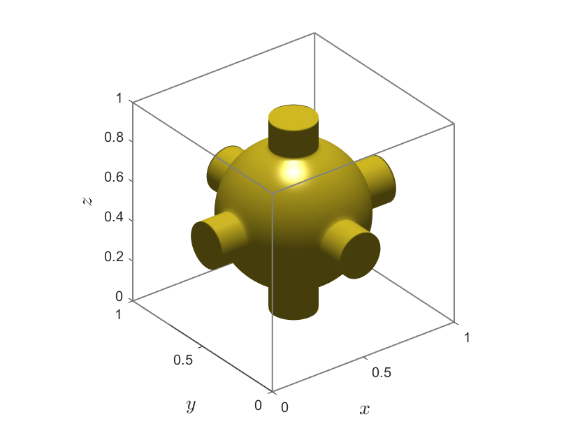
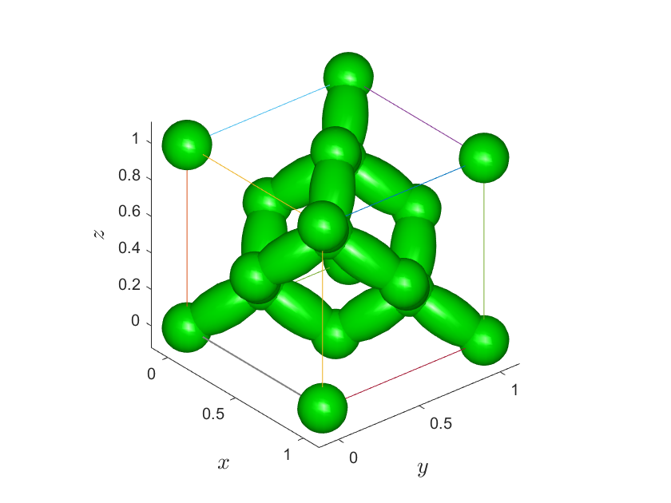
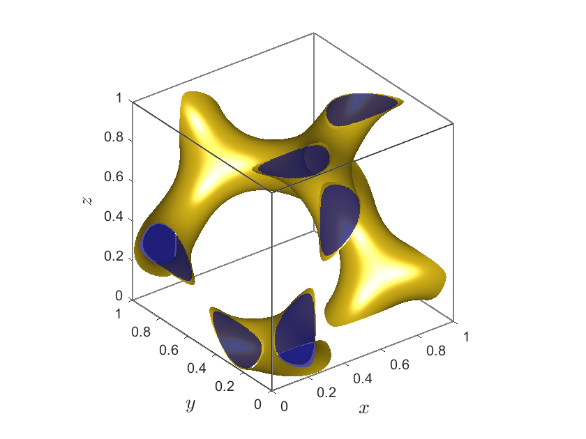
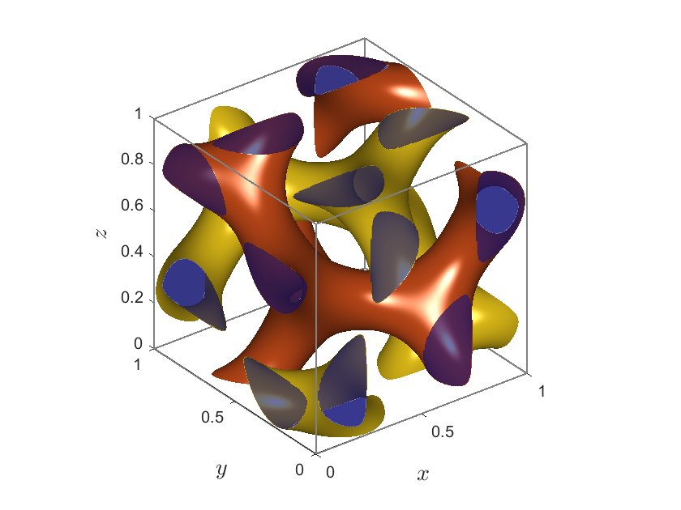
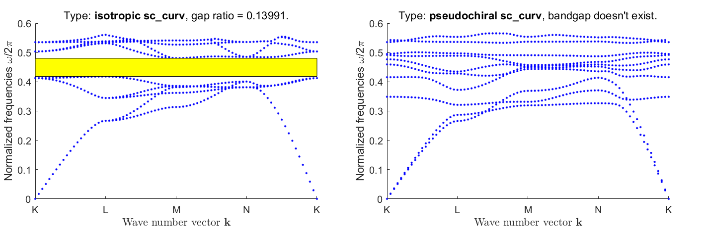
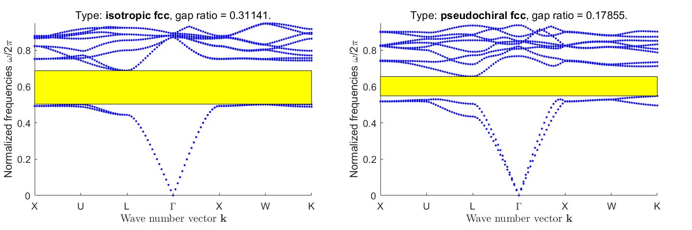
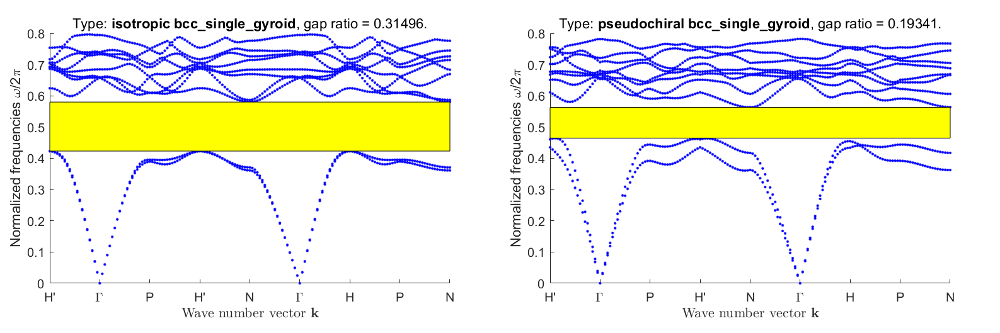
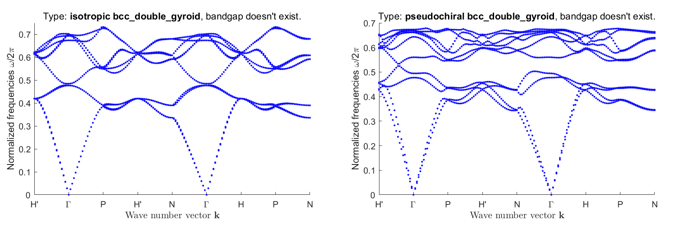

# Linear Eigenproblems in Photonic Crystals

**Version:** [](https://www.python.org/) [](https://www.mathworks.com/)

**Papers:** [](https://doi.org/10.1002/num.23171) [](https://doi.org/10.48550/arXiv.2511.17107)

**Platform:** []() []()

**Core Library 🚀:** [CuPy](https://cupy.dev/) for accelerated linear algebra.

## Overview

This repository contains implementations for two related papers:

| Paper   | Folder                               | Status                                       |
| ------- | ------------------------------------ | -------------------------------------------- |
| Paper 1 | `paper_1_matlab/`, `paper_1_python/` | Historical archive                           |
| Paper 2 | `paper_2/`                           | **Main implementation** — supersedes Paper 1 |

> **Note:** The `paper_2/` implementation is the recommended codebase. It reproduces all examples from Paper 1 with improved structure and time-efficient functions.

The structure of the repository is outlined as follows:

```
├── paper_1_matlab/          # Paper 1 MATLAB code (archive)
├── paper_1_python/          # Paper 1 Python code (archive)
├── paper_2/                 # Paper 2 — main implementation
│   ├── dielectric_examples/     # (folder) Storing dieletric indices
│   ├── output/                  # Results of bandgap
│   ├── _kernels.py              # CUDA kernels for Python
│   ├── dielectric.py            # I/O and computation of dielectric indices 
│   ├── discretization.py        # Mimetic finite difference operators
│   ├── lobpcg.py                # LOBPCG eigensolver
│   ├── numerical_experiments.py # Experiment runners
│   ├── orthogonalization.py     # Orthogonalization utilities for LOBPCG
│   ├── pcfft.py                 # FFT-based matrix-free operations
│   └── run.sh                   # Shell for quick start
├── pic/                     # Visualization assets
├── README.md				 # Readme markdown (simplified, math theory left out).
├── (Paper 1) ... .pdf		 # Paper 1 PDF.
├── (Paper 2) ... .pdf		 # Paper 2 PDF.
└──	README_FULL.pdf			 # Readme full version.
```

## Mathematical Theory

Computational framework for photonic bandgap analysis using finite difference (Yee's scheme) with kernel compensation. The mathematical model problem is given by:

$$
	\begin{cases} 
&\nabla \times (\varepsilon^{-1} \nabla \times \boldsymbol{H}) = \omega^2 \boldsymbol{H},\quad&  \text{in } \mathbb{R}^{3}, \\ 
&\nabla \cdot \boldsymbol{H} = 0, \quad& \text{in } \mathbb{R}^{3},
\end{cases}
$$

where $\boldsymbol{H}$ is the magnetic field, $\omega$ is the frequency and $\varepsilon=\varepsilon(\omega,\boldsymbol{x})$ is the dielectric function. In this project, $\varepsilon$ depends ONLY on the spatial position $\boldsymbol{x}$, resulting in linear eigenproblems. The case where $\varepsilon$ is frequency-dependent (which results in nonlinear eigenproblems) is considered and solved in the repository <https://github.com/Epsilon-79th/NHEP-nonlinear-Hermitian-eigenproblem-in-photonic-crystals>. The major contribution of Paper 2 lies in the novel discretization towards $\varepsilon^{-1}$. To be precise, the definition of $\varepsilon^{-1}$ is given by

$$
\varepsilon^{-1}(\boldsymbol{x}) = \begin{cases} 
\varepsilon_1, & \boldsymbol{x} \in \Omega_1, \\ 
I_3, & \boldsymbol{x} \in \Omega \setminus \Omega_1, 
\end{cases}
$$

where $I_3$ is the $3\times 3$ identity matrix and $\varepsilon_ 1$ is a constant $3\times 3$ Hermitian positive definite (HPD) tensor. In Paper 1 we consider the case where $\varepsilon_ 1$ is a diagonal matrix, while in Paper 2 nonzero off-diagonal entries occur. The discretization should preserve the consistency of degrees of freedom (DoFs) as well as the HPD property, which means the discrete form of $\varepsilon^{-1}$, denoted by $M$, should also be HPD. In Paper 2 we introduce two approaches and prove $M$ derived from both approaches are HPD.  

We also give a brief summary on how kernel compensation works in the double-curl problem. Under the framework of mimetic finite difference, the magnetic field is approximated by face DoFs $H_ h$. On the uniform grid where each axis is $N$-partitioned, the total DoFs equals $3N^ 3$, thus $H_ h\in C^ {3N^ 3}$. The discrete curl, divergence operator is stored by sparse matrix $A$, $B$ respectively. The double curl operator is treated by adjoint relation where the outer curl is approximated by $A$ while the inner curl approximated by its conjugate transpose $A^ \dagger$. The original discrete formulation (left) and the kernel compensation formulation (right) are shown below:

$$
\begin{cases}
	(AMA^\dagger)H_h = \omega^2 H_h, \\ 
	BH_h=0.
\end{cases} \qquad\Leftrightarrow \qquad (AMA^\dagger+\gamma B^\dagger B)H_h = \omega^2 H_h.
$$

The kernel compensation solves correct desired eigenpairs with the penalty coefficient $\gamma$ chosen as $\gamma=4\pi^ 2$. We also replace the sparse matrix multiplications by matrix-free operations via FFT in 3D so that the global matrix $AMA^\dagger+\gamma B^\dagger B$ is unnecessary to assemble.  A detailed explanation of the entire discretization framework can be found in the `README_FULL` PDF. 

## Physical Parameters

We consider simple cubic (`SC`),  face centered cubic (`FCC`) and body centered (`BCC`) lattices in the experiment. The expression of lattice translation vectors $\{\boldsymbol{a}_i\}_{i=1}^3$ are

$$
\begin{cases}
\text{SC lattice:\ }\quad&\boldsymbol a_1=(1,0,0), \ \ \boldsymbol a_2=(0,1,0),\ \ \boldsymbol a_3=(0,0,1).\\
\text{FCC lattice:\ }\quad&\boldsymbol a_1=(0,\frac{1}{2},\frac{1}{2}), \ \boldsymbol a_2=(\frac{1}{2},0,\frac{1}{2}),\ \boldsymbol a_3=(\frac{1}{2},\frac{1}{2},0).\\
\text{BCC lattice:\ }\quad&\boldsymbol a_1=(-\frac{1}{2},\frac{1}{2},\frac{1}{2}),\ \boldsymbol a_2=(\frac{1}{2},-\frac{1}{2},\frac{1}{2}),\ \boldsymbol a_3=(\frac{1}{2},\frac{1}{2},-\frac{1}{2}).
\end{cases}
$$

The wave number vector $\mathbf{k}$ is derived from symmetry points and partition points on their connecting lines in the Brillouin zone. These symmetry points are:

$$
\begin{cases}
\text{SC:} \quad & \Gamma(0,0,0), L(\pi,0,0), M(\pi,\pi,0), N(\pi,\pi,\pi), \\
\text{FCC:} \quad & X(0,2\pi,0), U\left(\frac{\pi}{2},2\pi,\pi\right), L(\pi,\pi,\pi), \Gamma(0,0,0), W(\pi,2\pi,0), K\left(\frac{3\pi}{2},\frac{3\pi}{2},0\right), \\
\text{BCC:} \quad & H'(2\pi,0,0), \Gamma(0,0,0), P(\pi,\pi,\pi), N(\pi,0,\pi), H(0,2\pi,0).
\end{cases}
$$


## Main Implementation of Paper 2

### Core Modules

| Module              | Description                                                  |
| ------------------- | ------------------------------------------------------------ |
| `discretization.py` | Mimetic finite difference discretization, construction of matrix-free operators |
| `lobpcg.py`         | Custom Knyazev's Locally Optimal Block Preconditioned Conjugate Gradient eigensolver |
| `_kernels.py`       | CUDA kernels for Python, imported by `pcfft.py`              |
| `dielectric.py`     | I/O Dielectric tensor manipulation                           |
| `pcfft.py`          | FFT-based matrix-free operations.                            |

We provide several details of the programming:

- **Storage** The matrix-free operations involve matrix blocks $K_A,K_B$ and $K_P^{-1}$, whose constructions can be found in Paer 2. $K_A$ is stored by a $3N^3$ double-precision complex array while $K_B$ and $K_P^{-1}$ are respectively stored by a tuple including a $3N^3$ double-precision float array and a $3N^3$ double-precision complex array. The overall storage of these matrix-free operators sums up to $192N^3$ Bytes. If we choose $N=100$, $N=120$ and $N=150$, then the storage is $183.11$ MiB, $316.41$ MiB and $617.98$ MiB respectively.
- **I/O of dielectric indices** For a given lattice geometry, we record the indices of all DoFs located within the material region $\Omega\_1$. These indices are categorized and stored in the `dielectric_examples` directory `edge_dofs/` and `volume_dofs/`.  Indices are stored as **integer arrays** in binary (`.bin`) format. The indexing process is vectorized and accelerated by the GPU. For standard $N^3$ grids, the total indexing and pre-processing time is **less than 1 second**.
- **How \_kernels.py improves efficiency**  Custom `cupy.ElementwiseKernel` implementations for $K_A$ and $K_B, K_P^{-1}$ operators that deliver matrix-free efficiency **close to native C++ CUDA**.
- **Settings of LOBPCG** Our implementation is based on **Knyazev's seminal LOBPCG algorithm**, enhanced with a **soft-locking** mechanism to prevent convergence stagnation. The module provides a flexible framework supporting:
  - **Problem Types**: Simple eigenproblems ($A\boldsymbol x=\lambda \boldsymbol x$) and general eigenproblems  ($A\boldsymbol x=\lambda B\boldsymbol x$).
  - **Target Eigenvalues**: Configurable for smallest or largest magnitude.
  - **Locking Strategies**: Supports both with and without soft-locking modes.
  - **Core Routine**: The default robust solver invokes `lobpcg_sep_softlock`, which integrates these features for optimal stability.

### Running Examples

```bash
cd paper_2

# shell (default: 0, numerical_experiments.py; 2 stands for paper_2_test.py)
./run.sh
./run.sh 0
./run.sh 2

# python
python paper_2_test.py
python numerical_experiments.py
```

## Numerical Results

### Materials

<table>
  <tr>
    <td align="center" width="50%">
      <br>
      <sub>(a) SC-CURV</sub>
    </td>
    <td align="center" width="50%">
      <br>
      <sub>(b) FCC</sub>
    </td>
  </tr>
  <tr>
    <td align="center" width="50%">
      <br>
      <sub>(c) BCC-SG</sub>
    </td>
    <td align="center" width="50%">
      <br>
      <sub>(d) BCC-DG</sub>
    </td>
  </tr>
</table>
<p align="center">
  <strong>Figure:</strong> Material structures of four sample lattices in cubic domain $[0, 1]^3$.
</p>


### Bandgap Figures
<p align="center">
  
</p>
<p align="center">
  <strong>Figure:</strong> Band structures of SC lattice with curved material interface. Left: isotropic system; Right: pseudochiral system.
</p>

<p align="center">
  
</p>
<p align="center">
  <strong>Figure:</strong> Band structures of FCC lattice. Left: isotropic system; Right: pseudochiral system.
</p>

<p align="center">
  
</p>
<p align="center">
  <strong>Figure:</strong> Band structures of BCC lattice with single gyroid interface. Left: isotropic system; Right: pseudochiral system.
</p>

<p align="center">
  
</p>
<p align="center">
  <strong>Figure:</strong> Band structures of BCC lattice with double gyroid interface. Left: isotropic system; Right: pseudochiral system.
</p>

### Runtime Tables

The benchmarks presented below are exclusively from **Paper 2** (Python implementation). This version fully covers the numerical experiments from Paper 1 (MATLAB) while delivering a significant performance boost. By leveraging GPU acceleration (CuPy), we achieved an average speedup of **~40x** compared to CPU execution, making the solver highly efficient for large-scale 3D photonic crystal problems.

<table>
  <thead>
    <tr>
      <th rowspan="2">DoFs</th>
      <th colspan="4" style="text-align:center;">Isotropic SC-CURV</th>
      <th colspan="4" style="text-align:center;">Pseudochiral SC-CURV</th>
    </tr>
    <tr>
      <th>Steps</th>
      <th>GPU time</th>
      <th>CPU time</th>
      <th>Speed up</th>
      <th>Steps</th>
      <th>GPU time</th>
      <th>CPU time</th>
      <th>Speed up</th>
    </tr>
  </thead>
  <tbody>
    <tr>
      <td>3 × 100³</td>
      <td>31</td>
      <td>10.79</td>
      <td>432.71</td>
      <td>40.10</td>
      <td>50</td>
      <td>16.67</td>
      <td>666.39</td>
      <td>39.98</td>
    </tr>
    <tr>
      <td>3 × 120³</td>
      <td>34</td>
      <td>19.85</td>
      <td>835.91</td>
      <td>42.11</td>
      <td>49</td>
      <td>28.67</td>
      <td>1297.50</td>
      <td>45.26</td>
    </tr>
    <!-- FCC Section Header -->
    <tr>
      <th rowspan="2">DoFs</th>
      <th colspan="4" style="text-align:center;">Isotropic FCC</th>
      <th colspan="4" style="text-align:center;">Pseudochiral FCC</th>
    </tr>
    <tr>
      <th>Steps</th>
      <th>GPU time</th>
      <th>CPU time</th>
      <th>Speed up</th>
      <th>Steps</th>
      <th>GPU time</th>
      <th>CPU time</th>
      <th>Speed up</th>
    </tr>
    <tr>
      <td>3 × 100³</td>
      <td>45</td>
      <td>16.00</td>
      <td>623.77</td>
      <td>39.01</td>
      <td>56</td>
      <td>19.59</td>
      <td>852.17</td>
      <td>43.50</td>
    </tr>
    <tr>
      <td>3 × 120³</td>
      <td>45</td>
      <td>27.71</td>
      <td>1197.90</td>
      <td>43.23</td>
      <td>55</td>
      <td>34.15</td>
      <td>1506.35</td>
      <td>44.11</td>
    </tr>
    <!-- BCC-SG Section Header -->
    <tr>
      <th rowspan="2">DoFs</th>
      <th colspan="4" style="text-align:center;">Isotropic BCC-SG</th>
      <th colspan="4" style="text-align:center;">Pseudochiral BCC-SG</th>
    </tr>
    <tr>
      <th>Steps</th>
      <th>GPU time</th>
      <th>CPU time</th>
      <th>Speed up</th>
      <th>Steps</th>
      <th>GPU time</th>
      <th>CPU time</th>
      <th>Speed up</th>
    </tr>
    <tr>
      <td>3 × 100³</td>
      <td>57</td>
      <td>19.85</td>
      <td>835.33</td>
      <td>42.08</td>
      <td>68</td>
      <td>24.14</td>
      <td>1020.15</td>
      <td>42.26</td>
    </tr>
    <tr>
      <td>3 × 120³</td>
      <td>47</td>
      <td>27.96</td>
      <td>1295.39</td>
      <td>46.33</td>
      <td>65</td>
      <td>41.08</td>
      <td>1816.56</td>
      <td>44.22</td>
    </tr>
    <!-- BCC-DG Section Header -->
    <tr>
      <th rowspan="2">DoFs</th>
      <th colspan="4" style="text-align:center;">Isotropic BCC-DG</th>
      <th colspan="4" style="text-align:center;">Pseudochiral BCC-DG</th>
    </tr>
    <tr>
      <th>Steps</th>
      <th>GPU time</th>
      <th>CPU time</th>
      <th>Speed up</th>
      <th>Steps</th>
      <th>GPU time</th>
      <th>CPU time</th>
      <th>Speed up</th>
    </tr>
    <tr>
      <td>3 × 100³</td>
      <td>89</td>
      <td>26.83</td>
      <td>1056.57</td>
      <td>39.98</td>
      <td>77</td>
      <td>25.25</td>
      <td>1038.00</td>
      <td>41.11</td>
    </tr>
    <tr>
      <td>3 × 120³</td>
      <td>86</td>
      <td>44.61</td>
      <td>1903.39</td>
      <td>43.20</td>
      <td>76</td>
      <td>43.55</td>
      <td>1971.94</td>
      <td>45.28</td>
    </tr>
  </tbody>
</table>


## Citation

If you use this code, please cite the relevant papers:

```bibtex
@article{Jin_2025,
   title={Kernel Compensation Method for Maxwell Eigenproblem in Photonic Crystals With Mimetic Finite Difference Discretizations},
   volume={41},
   ISSN={1098-2426},
   url={http://dx.doi.org/10.1002/num.23171},
   DOI={10.1002/num.23171},
   number={2},
   journal={Numerical Methods for Partial Differential Equations},
   publisher={Wiley},
   author={Jin, Chenhao and Xia, Yinhua and Xu, Yan},
   year={2025},
   month=feb 
}

@misc{jin2025robustgpuacceleratedkernelcompensation,
      title={A Robust GPU-Accelerated Kernel Compensation Solver with Novel Discretization for Photonic Crystals in Pseudochiral Media}, 
      author={Chenhao Jin and Hehu Xie},
      year={2025},
      eprint={2511.17107},
      archivePrefix={arXiv},
      primaryClass={math.NA},
      url={https://arxiv.org/abs/2511.17107}, 
}
```

## License

[](https://opensource.org/licenses/MIT)

